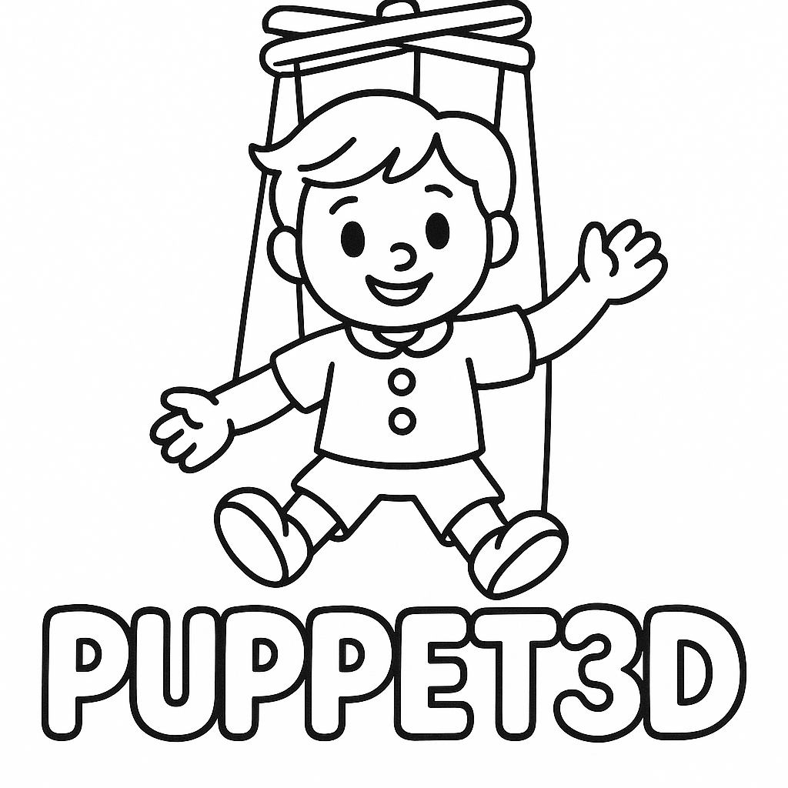

# Puppet3D WebAPP

This is the web application for Puppet3D.

Puppet3D is a MCP Server that allows LLM to control your 3D Avatar.  
You can upload your own 3D model, and use LLM to control it through the browser.  
You can self host this webapp, or use our Cloud Service.

## Features

- Upload your own 3D model
- Render your 3D model in the browser
- Support VR/AR by WebXR, you can meet your avatar in the real world

if you use our cloud service, you can:

- Save your avatar
- Chat with your avatar
- Share your avatar with others

## Protocol

LLM uses Puppet3D MCP tools to control the 3D avatar.  
Puppet3D MCP Server send JSON RPC 2.0 to the Puppet3D API Server.  
Puppet3D API Server send websocket messages to the Puppet3D WebAPP.
