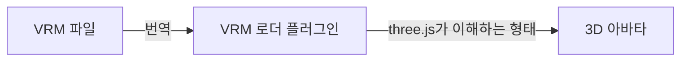
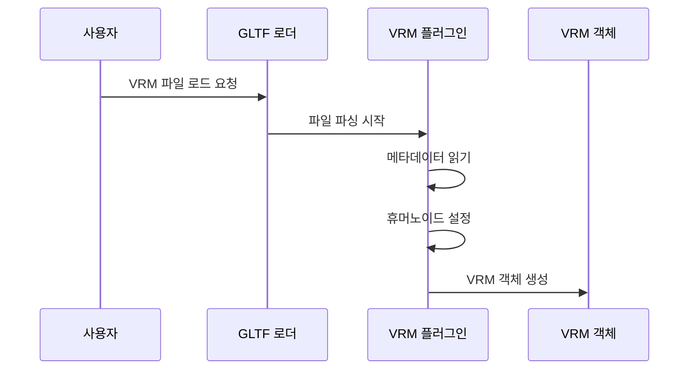

# Chapter 1: VRM 로더 플러그인 (VRMLoaderPlugin)

## 왜 VRM 로더가 필요할까요?

여러분이 웹사이트에 귀여운 3D 아바타를 넣고 싶다고 상상해보세요. VRM 파일로 된 캐릭터를 다운로드 받았는데, 이걸 어떻게 웹 브라우저에서 보여줄 수 있을까요?

바로 이런 상황에서 **VRM 로더 플러그인**이 필요합니다! 이 플러그인은 VRM 파일을 읽어서 three.js가 이해할 수 있는 형태로 변환해주는 도구입니다.

## VRM 로더 플러그인이란?

VRM 로더 플러그인을 **번역기**에 비유할 수 있습니다. VRM은 일본에서 만든 3D 아바타 형식인데, three.js는 기본적으로 이 형식을 이해하지 못합니다.



VRM 로더 플러그인은 다음과 같은 일을 합니다:

- VRM 파일의 데이터를 읽기
- 아바타의 뼈대, 표정, 머리카락 물리 등을 설정
- three.js에서 사용할 수 있는 객체로 변환

## VRM 로더 사용하기

VRM 로더를 사용하는 방법은 매우 간단합니다!

### 1단계: 필요한 도구 가져오기

```javascript
import { GLTFLoader } from "three/examples/jsm/loaders/GLTFLoader.js";
import { VRMLoaderPlugin } from "@pixiv/three-vrm";
```

GLTFLoader는 3D 모델을 불러오는 기본 도구이고, VRMLoaderPlugin은 VRM 파일을 위한 특별한 플러그인입니다.

### 2단계: 로더 설정하기

```javascript
// GLTF 로더 만들기
const loader = new GLTFLoader();

// VRM 플러그인 추가하기
loader.register((parser) => {
  return new VRMLoaderPlugin(parser);
});
```

이 코드는 GLTF 로더에 "VRM 파일도 읽을 수 있어요!"라고 알려주는 것과 같습니다.

### 3단계: VRM 파일 불러오기

```javascript
loader.load(
  "avatar.vrm", // VRM 파일 경로
  (gltf) => {
    const vrm = gltf.userData.vrm; // VRM 객체 가져오기
    scene.add(vrm.scene); // 씬에 추가하기
  },
);
```

파일을 불러오면 `gltf.userData.vrm`에 완성된 VRM 아바타가 들어있습니다!

## 내부 동작 원리

VRM 로더가 어떻게 동작하는지 단계별로 살펴보겠습니다.



### 플러그인 시스템

VRM 로더는 여러 개의 작은 플러그인들로 구성되어 있습니다:

```javascript
// VRMLoaderPlugin 내부 구조 (간단히)
class VRMLoaderPlugin {
  constructor(parser) {
    this.metaPlugin = new VRMMetaLoaderPlugin(parser);
    this.humanoidPlugin = new VRMHumanoidLoaderPlugin(parser);
    this.expressionPlugin = new VRMExpressionLoaderPlugin(parser);
    // ... 더 많은 플러그인들
  }
}
```

각 플러그인은 특정한 역할을 담당합니다:

- **메타 플러그인**: 아바타의 이름, 저작자 정보 등을 읽습니다
- **휴머노이드 플러그인**: 아바타의 뼈대를 설정합니다
- **표정 플러그인**: 웃기, 화내기 등의 표정을 설정합니다

### 로딩 과정

VRM 파일이 로드될 때 다음과 같은 순서로 처리됩니다:

```javascript
async afterRoot(gltf) {
    // 1. 각 플러그인이 자신의 데이터를 처리
    await this.metaPlugin.afterRoot(gltf);
    await this.humanoidPlugin.afterRoot(gltf);

    // 2. 모든 데이터가 준비되면 VRM 객체 생성
    const vrm = new VRM({
        scene: gltf.scene,
        humanoid: gltf.userData.vrmHumanoid,
        meta: gltf.userData.vrmMeta
    });

    // 3. 결과 저장
    gltf.userData.vrm = vrm;
}
```

이 과정은 요리에 비유할 수 있습니다:

1. 각 요리사(플러그인)가 재료를 준비합니다
2. 모든 재료가 준비되면 요리(VRM 객체)를 만듭니다
3. 완성된 요리를 접시(userData)에 담습니다

## 정리

이번 장에서는 VRM 로더 플러그인에 대해 배웠습니다:

- VRM 로더는 VRM 파일을 three.js에서 사용할 수 있게 변환하는 번역기입니다
- GLTFLoader에 플러그인으로 추가하여 사용합니다
- 내부적으로 여러 작은 플러그인들이 협력하여 작동합니다

이제 VRM 파일을 불러올 수 있게 되었습니다! 다음 장에서는 불러온 [VRM 모델](02_vrm_모델__vrm_vrmcore__.md)의 구조와 사용법에 대해 자세히 알아보겠습니다.

---

Generated by [AI Codebase Knowledge Builder](https://github.com/The-Pocket/Tutorial-Codebase-Knowledge)
