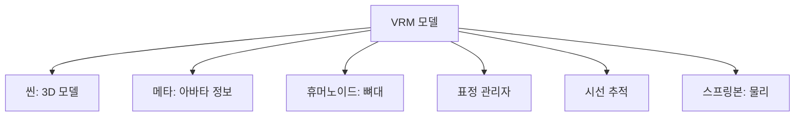
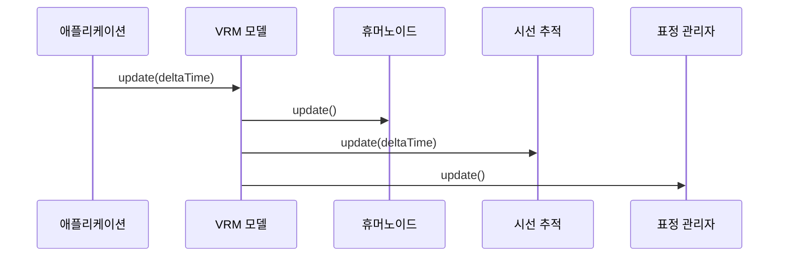

# Chapter 2: VRM 모델 (VRM/VRMCore)

[이전 장](01_vrm_로더_플러그인__vrmloaderplugin__.md)에서 VRM 파일을 불러오는 방법을 배웠습니다. 이제 불러온 VRM 모델이 실제로 어떻게 구성되어 있고, 어떻게 사용하는지 알아보겠습니다!

## VRM 모델이 필요한 이유

여러분이 3D 아바타를 불러왔다고 생각해보세요. 이제 이 아바타가 웃게 하고 싶고, 고개를 돌리게 하고 싶고, 머리카락이 자연스럽게 흔들리게 하고 싶습니다. 하지만 이런 기능들이 모두 흩어져 있다면 관리하기가 매우 어려울 것입니다.

**VRM 모델**은 이 모든 기능을 하나로 묶어주는 **상자**와 같습니다. 마치 스마트폰이 전화, 카메라, 인터넷 등 여러 기능을 하나로 묶어 제공하는 것처럼, VRM 모델은 아바타의 모든 기능을 하나로 묶어 제공합니다.

## VRM 모델의 구성 요소

VRM 모델은 여러 부품으로 구성되어 있습니다. 각 부품을 하나씩 살펴보겠습니다:



### 핵심 구성 요소 (VRMCore)

**VRMCore**는 VRM의 가장 기본적인 구성 요소들을 담고 있습니다:

1. **scene**: 실제 3D 모델이 들어있는 곳
2. **meta**: 아바타의 이름, 제작자 정보 등
3. **humanoid**: 아바타의 뼈대 (팔, 다리, 머리 등)
4. **expressionManager**: 표정 관리 (웃기, 화내기 등)
5. **firstPerson**: 1인칭 시점 설정
6. **lookAt**: 시선 처리 (눈동자 움직임)

### 확장 구성 요소 (VRM)

**VRM** 클래스는 VRMCore를 확장하여 추가 기능을 제공합니다:

1. **materials**: 재질 (피부, 옷 등의 표면)
2. **springBoneManager**: 머리카락, 옷자락 등의 물리 효과
3. **nodeConstraintManager**: 관절 제약 (팔꿈치가 반대로 꺾이지 않게 등)

## VRM 모델 사용하기

이제 실제로 VRM 모델을 사용하는 방법을 알아보겠습니다!

### 1단계: VRM 모델 가져오기

```javascript
// VRM 파일 불러오기
loader.load("avatar.vrm", (gltf) => {
  const vrm = gltf.userData.vrm; // VRM 모델 가져오기
  scene.add(vrm.scene); // 씬에 추가
});
```

불러온 VRM 모델은 `gltf.userData.vrm`에 저장되어 있습니다.

### 2단계: 업데이트 루프 설정

```javascript
function animate() {
  requestAnimationFrame(animate);

  const deltaTime = clock.getDelta();
  vrm.update(deltaTime); // VRM 업데이트

  renderer.render(scene, camera);
}
```

**중요!** VRM 모델은 매 프레임마다 `update` 메서드를 호출해야 합니다. 이것은 표정, 시선, 물리 효과 등이 자연스럽게 움직이도록 합니다.

### 3단계: 아바타 정보 확인하기

```javascript
// 아바타 이름 확인
console.log("아바타 이름:", vrm.meta.name);

// 제작자 정보
console.log("제작자:", vrm.meta.authors);

// 라이선스 정보
console.log("사용 허가:", vrm.meta.commercialUssageName);
```

VRM의 메타 정보를 통해 아바타의 사용 조건을 확인할 수 있습니다.

### 4단계: 표정 바꾸기

```javascript
// 웃는 표정 만들기
vrm.expressionManager.setValue("happy", 1.0);

// 눈 감기
vrm.expressionManager.setValue("blink", 1.0);
```

표정 관리자를 통해 다양한 표정을 만들 수 있습니다!

### 5단계: 시선 조작하기

```javascript
// 특정 위치 바라보게 하기
const target = new THREE.Vector3(1, 1.5, 2);
vrm.lookAt.target = target;
```

시선 추적 기능으로 아바타가 특정 위치를 바라보게 할 수 있습니다.

## 내부 동작 원리

VRM 모델이 어떻게 동작하는지 자세히 살펴보겠습니다.

### 업데이트 과정

VRM의 `update` 메서드가 호출될 때 일어나는 일을 살펴보겠습니다:



### VRMCore의 업데이트 구현

```javascript
// VRMCore의 update 메서드 (간략화)
update(delta) {
    // 1. 휴머노이드 업데이트 (뼈대 위치 계산)
    this.humanoid.update();

    // 2. 시선 업데이트 (눈동자 움직임)
    if (this.lookAt) {
        this.lookAt.update(delta);
    }
}
```

각 단계가 하는 일:

1. **휴머노이드**: 애니메이션에 따라 뼈대 위치를 업데이트합니다
2. **시선 추적**: 목표 위치를 향해 눈과 머리를 회전시킵니다

### VRM의 추가 업데이트

```javascript
// VRM의 update 메서드 (간략화)
update(delta) {
    // 부모 클래스 업데이트
    super.update(delta);

    // 3. 물리 시뮬레이션 (머리카락 등)
    if (this.springBoneManager) {
        this.springBoneManager.update(delta);
    }
}
```

VRM 클래스는 VRMCore의 기능에 더해:

- **스프링본**: 머리카락, 리본 등이 자연스럽게 흔들리도록 물리 시뮬레이션을 수행합니다

### VRM 객체 생성 과정

VRM 객체가 어떻게 만들어지는지 살펴보겠습니다:

```javascript
// VRM 생성자 (간략화)
constructor(params) {
    // 기본 구성 요소 설정
    this.scene = params.scene;
    this.meta = params.meta;
    this.humanoid = params.humanoid;

    // 선택적 구성 요소
    this.expressionManager = params.expressionManager;
    this.springBoneManager = params.springBoneManager;
}
```

이 과정은 자동차 조립에 비유할 수 있습니다:

- **필수 부품**: 엔진(scene), 차체(humanoid), 번호판(meta)
- **선택 부품**: 에어컨(expressionManager), 서스펜션(springBoneManager)

## 정리

이번 장에서는 VRM 모델의 구조와 사용법을 배웠습니다:

- VRM 모델은 아바타의 모든 기능을 하나로 묶은 컨테이너입니다
- VRMCore는 기본 기능을, VRM은 확장 기능을 제공합니다
- 매 프레임마다 `update` 메서드를 호출해야 합니다
- 표정, 시선, 물리 효과 등을 쉽게 제어할 수 있습니다

VRM 모델의 기본을 이해했으니, 다음 장에서는 아바타의 뼈대를 다루는 [휴머노이드 시스템](03_휴머노이드_시스템__vrmhumanoid__.md)에 대해 자세히 알아보겠습니다!

---

Generated by [AI Codebase Knowledge Builder](https://github.com/The-Pocket/Tutorial-Codebase-Knowledge)
