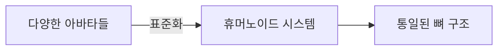
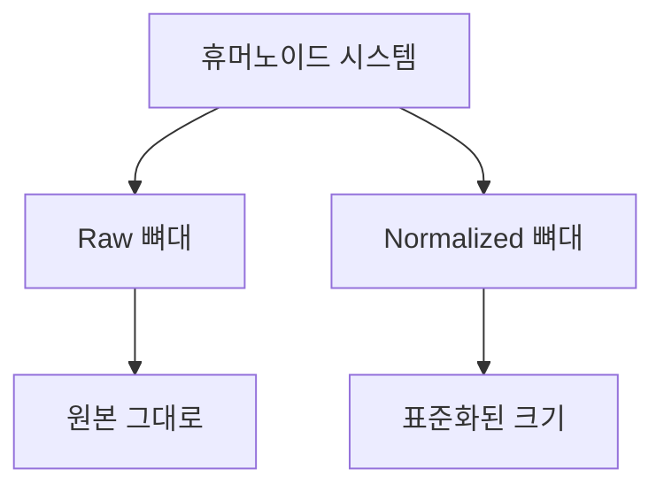
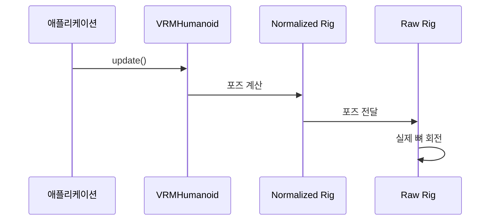

# Chapter 3: 휴머노이드 시스템 (VRMHumanoid)

[이전 장](02_vrm_모델__vrm_vrmcore__.md)에서 VRM 모델의 구조와 사용법을 배웠습니다. 이제 VRM 아바타의 뼈대를 다루는 가장 중요한 시스템인 **휴머노이드 시스템**에 대해 알아보겠습니다!

## 휴머노이드 시스템이 필요한 이유

여러분이 인형을 가지고 놀아본 적이 있나요? 인형의 팔을 들어올리거나, 다리를 움직이거나, 고개를 돌릴 수 있었을 것입니다. 3D 아바타도 마찬가지입니다!

하지만 문제가 있습니다. 만약 여러분이 다른 회사에서 만든 두 개의 인형을 가지고 있다면, 각 인형의 관절 이름이 다를 수 있습니다:

- A 인형: "왼팔위", "왼팔아래"
- B 인형: "left_upper_arm", "left_lower_arm"

이런 차이 때문에 같은 동작을 시키기가 어렵습니다. **휴머노이드 시스템**은 이 문제를 해결합니다! 모든 아바타가 동일한 뼈 이름을 사용하도록 **표준화**하는 것이죠.



## 뼈대 구조 이해하기

### T-포즈란?

VRM 아바타는 기본적으로 **T-포즈**라는 자세를 취하고 있습니다. 이름 그대로 팔을 옆으로 뻗어 'T'자 모양을 만든 자세입니다.

```
    O     <- 머리 (head)
   /|\
  / | \   <- 팔을 옆으로 뻗은 모습
    |
   / \    <- 다리
```

T-포즈는 모든 동작의 **기준점**이 됩니다. 모든 애니메이션과 포즈는 이 T-포즈에서 얼마나 회전했는지로 표현됩니다.

### 주요 뼈 이름들

VRM은 사람의 뼈를 영어로 표준화했습니다. 주요 뼈들을 살펴보겠습니다:

```javascript
// 몸통
"hips"; // 엉덩이 (전체 이동의 중심)
"spine"; // 척추
"chest"; // 가슴
"neck"; // 목
"head"; // 머리

// 팔
"leftUpperArm"; // 왼쪽 위팔
"leftLowerArm"; // 왼쪽 아래팔
"leftHand"; // 왼쪽 손
```

이런 이름들은 모든 VRM 아바타에서 동일하게 사용됩니다!

## 휴머노이드 시스템 사용하기

이제 실제로 아바타의 뼈대를 조작해보겠습니다!

### 1단계: 뼈 가져오기

```javascript
// 특정 뼈 가져오기
const leftArm = vrm.humanoid.getRawBone("leftUpperArm");
const head = vrm.humanoid.getRawBone("head");
```

`getRawBone` 메서드로 원하는 뼈를 가져올 수 있습니다.

### 2단계: 현재 포즈 확인하기

```javascript
// 현재 포즈 가져오기
const currentPose = vrm.humanoid.getRawPose();
console.log("왼팔 회전:", currentPose.leftUpperArm);
```

현재 아바타가 어떤 포즈를 취하고 있는지 확인할 수 있습니다.

### 3단계: 포즈 바꾸기

```javascript
// 손 흔들기 포즈 만들기
const wavePose = {
  leftUpperArm: {
    rotation: [0, 0, -0.5, 0.866], // 쿼터니언 회전값
  },
};

vrm.humanoid.setRawPose(wavePose);
```

이렇게 하면 왼팔을 들어올려 손을 흔드는 포즈를 만들 수 있습니다!

### 4단계: 포즈 초기화

```javascript
// T-포즈로 돌아가기
vrm.humanoid.resetRawPose();
```

언제든지 기본 T-포즈로 돌아갈 수 있습니다.

## Raw와 Normalized의 차이

휴머노이드 시스템에는 두 가지 모드가 있습니다:



### Raw 뼈대

- 아바타의 **원본 크기** 그대로 사용
- 키가 큰 아바타는 뼈도 길고, 작은 아바타는 뼈도 짧음

### Normalized 뼈대

- 모든 아바타를 **동일한 크기**로 표준화
- 다른 아바타의 애니메이션을 쉽게 적용 가능

```javascript
// Raw 사용 (원본 크기)
vrm.humanoid.setRawPose(pose);

// Normalized 사용 (표준 크기)
vrm.humanoid.setNormalizedPose(pose);
```

일반적으로는 Normalized를 사용하는 것이 애니메이션 재사용에 유리합니다!

## 내부 동작 원리

휴머노이드 시스템이 어떻게 동작하는지 살펴보겠습니다.

### 업데이트 과정



### 자동 업데이트 시스템

```javascript
// VRMHumanoid 내부 구조 (간략화)
class VRMHumanoid {
  autoUpdateHumanBones = true; // 자동 업데이트 활성화

  update() {
    if (this.autoUpdateHumanBones) {
      // Normalized에서 Raw로 자동 전달
      this._normalizedHumanBones.update();
    }
  }
}
```

`autoUpdateHumanBones`가 true면 Normalized 포즈가 자동으로 Raw 포즈로 변환됩니다.

### VRMRig의 포즈 처리

```javascript
// 포즈 설정 과정 (간략화)
setPose(poseObject) {
    Object.entries(poseObject).forEach(([boneName, state]) => {
        const node = this.getBoneNode(boneName);

        // 회전 적용
        if (state?.rotation) {
            node.quaternion.fromArray(state.rotation);
        }
    });
}
```

각 뼈의 회전값을 실제 3D 오브젝트에 적용합니다.

### 계층 구조 관리

아바타의 뼈는 **부모-자식 관계**로 연결되어 있습니다:

```
hips (엉덩이)
  └── spine (척추)
      └── chest (가슴)
          └── neck (목)
              └── head (머리)
```

부모가 회전하면 자식도 함께 회전합니다. 목을 돌리면 머리도 따라 돌아가는 것처럼요!

### VRMHumanoidRig의 표준화

```javascript
// 표준화 과정 (간략화)
class VRMHumanoidRig extends VRMRig {
  constructor(humanoid) {
    // 원본 뼈대의 위치와 회전 저장
    const boneWorldPositions = {};
    const boneWorldRotations = {};

    // 표준화된 새로운 뼈대 생성
    const rigBones = this._setupTransforms(humanoid);

    super(rigBones);
  }
}
```

원본 아바타의 뼈 정보를 분석해서 표준 크기의 새로운 뼈대를 만듭니다.

## 실전 예제: 간단한 댄스 만들기

배운 내용을 활용해 간단한 댄스 동작을 만들어보겠습니다!

```javascript
// 팔 벌리기 포즈
const armsUpPose = {
  leftUpperArm: { rotation: [0, 0, -0.7, 0.7] },
  rightUpperArm: { rotation: [0, 0, 0.7, 0.7] },
};

// 팔 내리기 포즈
const armsDownPose = {
  leftUpperArm: { rotation: [0, 0, 0, 1] },
  rightUpperArm: { rotation: [0, 0, 0, 1] },
};
```

```javascript
// 댄스 애니메이션
let time = 0;
function animate() {
  time += 0.02;

  // 1초마다 포즈 바꾸기
  if (Math.sin(time) > 0) {
    vrm.humanoid.setNormalizedPose(armsUpPose);
  } else {
    vrm.humanoid.setNormalizedPose(armsDownPose);
  }

  vrm.update(0.016);
  requestAnimationFrame(animate);
}
```

이렇게 하면 아바타가 팔을 올렸다 내렸다 하는 간단한 댄스를 춥니다!

## 정리

이번 장에서는 휴머노이드 시스템에 대해 배웠습니다:

- 휴머노이드 시스템은 아바타의 뼈대를 표준화합니다
- T-포즈를 기준으로 모든 동작을 정의합니다
- Raw와 Normalized 두 가지 모드를 제공합니다
- 포즈를 가져오고, 설정하고, 초기화할 수 있습니다
- 부모-자식 계층 구조로 자연스러운 움직임을 만듭니다

이제 아바타의 뼈대를 자유롭게 조작할 수 있게 되었습니다! 다음 장에서는 아바타를 더욱 예쁘게 만들어주는 [툰 셰이더 재질](04_툰_셰이더_재질__mtoonmaterial__.md)에 대해 알아보겠습니다.

---

Generated by [AI Codebase Knowledge Builder](https://github.com/The-Pocket/Tutorial-Codebase-Knowledge)
