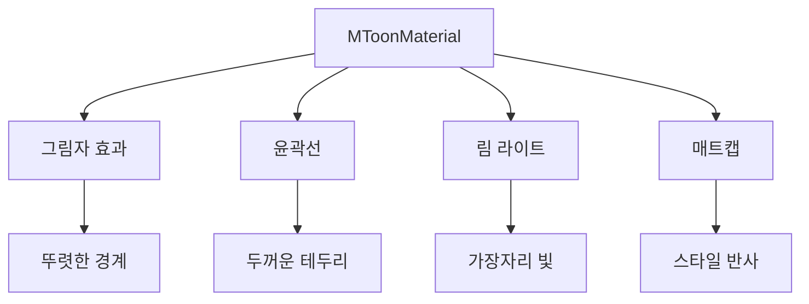
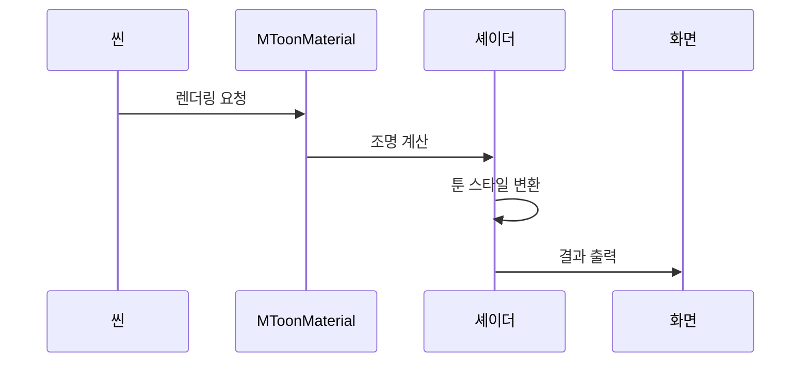

# Chapter 4: 툰 셰이더 재질 (MToonMaterial)

[이전 장](03_휴머노이드_시스템__vrmhumanoid__.md)에서 VRM 아바타의 뼈대를 다루는 방법을 배웠습니다. 이제 아바타를 더욱 매력적으로 만들어주는 특별한 재질인 **툰 셰이더 재질**에 대해 알아보겠습니다!

## 왜 툰 셰이더가 필요할까요?

여러분이 좋아하는 애니메이션을 떠올려보세요. 캐릭터의 그림자가 부드럽게 변하지 않고, 뚜렷한 경계선으로 나뉘어 있죠? 머리카락 가장자리에는 밝은 테두리가 있고, 옷은 마치 그림처럼 단순한 색으로 표현됩니다.

일반적인 3D 렌더링은 현실적인 그림자를 만들어냅니다:

```
밝음 → → → → → 어두움 (부드러운 변화)
```

하지만 애니메이션 스타일은 다릅니다:

```
밝음 | 어두움 (뚜렷한 경계)
```

**MToonMaterial**은 바로 이런 애니메이션 스타일의 렌더링을 가능하게 해주는 특별한 재질입니다!

## 툰 셰이더의 주요 기능

툰 셰이더는 애니메이션 캐릭터를 표현하기 위한 여러 기능을 제공합니다:



각 기능을 하나씩 살펴보겠습니다!

## MToonMaterial 사용하기

### 1단계: 재질 가져오기

```javascript
// VRM을 불러온 후 재질 확인
const materials = gltf.userData.vrmMToonMaterials;
console.log("MToon 재질 개수:", materials.length);
```

VRM 파일을 불러오면 자동으로 MToonMaterial이 적용됩니다!

### 2단계: 그림자 색상 바꾸기

```javascript
// 첫 번째 재질 가져오기
const material = materials[0];

// 그림자 색상 설정 (보라색 그림자)
material.shadeColorFactor = new THREE.Color(0.8, 0.7, 1.0);
```

`shadeColorFactor`는 그림자 부분의 색상을 결정합니다. 애니메이션에서는 종종 회색이 아닌 다른 색상의 그림자를 사용합니다!

### 3단계: 그림자 위치 조절하기

```javascript
// 그림자 위치 조절 (-1 ~ 1)
material.shadingShiftFactor = 0.0; // 기본값

// 양수: 그림자 영역 확대
material.shadingShiftFactor = 0.3;

// 음수: 그림자 영역 축소
material.shadingShiftFactor = -0.3;
```

`shadingShiftFactor`로 그림자가 얼마나 넓게 퍼질지 조절할 수 있습니다.

### 4단계: 그림자 경계 선명도 조절

```javascript
// 그림자 경계의 선명도 (0 ~ 1)
material.shadingToonyFactor = 0.9; // 기본값 (선명함)

// 더 선명한 경계
material.shadingToonyFactor = 1.0;

// 더 부드러운 경계
material.shadingToonyFactor = 0.5;
```

값이 클수록 애니메이션처럼 뚜렷한 그림자 경계가 만들어집니다!

## 윤곽선 효과

애니메이션 캐릭터의 또 다른 특징은 **검은 윤곽선**입니다:

### 윤곽선 설정하기

```javascript
// 윤곽선 모드 설정
material.outlineWidthMode = "worldCoordinates";

// 윤곽선 두께
material.outlineWidthFactor = 0.01;

// 윤곽선 색상
material.outlineColorFactor = new THREE.Color(0, 0, 0);
```

윤곽선 모드에는 세 가지가 있습니다:

- `'none'`: 윤곽선 없음
- `'worldCoordinates'`: 실제 크기 기준
- `'screenCoordinates'`: 화면 크기 기준

### 윤곽선과 조명 혼합

```javascript
// 조명 영향도 (0 ~ 1)
material.outlineLightingMixFactor = 0.0; // 순수한 검정

// 조명의 영향을 받는 윤곽선
material.outlineLightingMixFactor = 0.5;
```

값이 클수록 윤곽선이 조명의 영향을 받아 밝아집니다.

## 림 라이트 효과

림 라이트는 캐릭터 가장자리를 밝게 만드는 효과입니다:

```javascript
// 림 라이트 색상
material.parametricRimColorFactor = new THREE.Color(1, 1, 1);

// 림 라이트 강도
material.parametricRimLiftFactor = 0.0; // 기본값

// 림 라이트 범위
material.parametricRimFresnelPowerFactor = 5.0;
```

림 라이트는 캐릭터를 배경에서 돋보이게 만들어줍니다!

## 내부 동작 원리

MToonMaterial이 어떻게 애니메이션 스타일을 만드는지 살펴보겠습니다.

### 렌더링 과정



### 툰 셰이딩 계산

MToonMaterial의 핵심은 조명을 계산하는 방식에 있습니다:

```javascript
// 일반적인 셰이딩 (간략화)
const normalShading = dot(light, normal); // 0 ~ 1 연속값

// 툰 셰이딩 (간략화)
const toonShading = normalShading > threshold ? 1.0 : 0.5;
```

일반 셰이딩은 부드러운 값을 만들지만, 툰 셰이딩은 단계적인 값을 만듭니다!

### 윤곽선 생성 방법

MToonMaterial은 특별한 방법으로 윤곽선을 만듭니다:

```javascript
// 윤곽선 생성 과정 (간략화)
// 1. 같은 메시를 복제
const outlineMesh = mesh.clone();

// 2. 뒷면만 렌더링하도록 설정
outlineMaterial.side = THREE.BackSide;

// 3. 정점을 법선 방향으로 확장
// vertex += normal * outlineWidth;
```

메시를 두 번 그려서 윤곽선 효과를 만드는 영리한 방법입니다!

### 재질 업데이트

애니메이션 효과를 위해 매 프레임 업데이트가 필요합니다:

```javascript
// 애니메이션 루프에서
function animate() {
  const delta = clock.getDelta();

  // UV 애니메이션 업데이트
  material.update(delta);

  requestAnimationFrame(animate);
}
```

UV 애니메이션으로 텍스처가 움직이는 효과를 만들 수 있습니다!

## 실전 예제: 커스텀 애니메이션 스타일

배운 내용을 활용해 독특한 애니메이션 스타일을 만들어보겠습니다:

```javascript
// 파스텔톤 애니메이션 스타일
function setupPastelStyle(material) {
  // 부드러운 분홍색 그림자
  material.shadeColorFactor = new THREE.Color(1.0, 0.9, 0.95);

  // 넓은 그림자 영역
  material.shadingShiftFactor = 0.2;

  // 부드러운 경계
  material.shadingToonyFactor = 0.7;
}
```

```javascript
// 다크 판타지 스타일
function setupDarkStyle(material) {
  // 보라색 그림자
  material.shadeColorFactor = new THREE.Color(0.3, 0.2, 0.4);

  // 강한 림 라이트
  material.parametricRimColorFactor = new THREE.Color(0.5, 0.7, 1.0);
  material.parametricRimLiftFactor = 0.5;
}
```

이렇게 다양한 스타일을 쉽게 만들 수 있습니다!

## 정리

이번 장에서는 툰 셰이더 재질(MToonMaterial)에 대해 배웠습니다:

- MToonMaterial은 애니메이션 스타일의 3D 렌더링을 가능하게 합니다
- 뚜렷한 그림자 경계와 윤곽선으로 만화같은 느낌을 만듭니다
- 그림자 색상, 위치, 선명도를 자유롭게 조절할 수 있습니다
- 림 라이트로 캐릭터를 더욱 돋보이게 만들 수 있습니다
- 내부적으로 특별한 셰이딩 계산과 메시 복제를 사용합니다

이제 아바타를 애니메이션처럼 예쁘게 렌더링할 수 있게 되었습니다! 다음 장에서는 아바타의 표정을 다루는 [표정 관리자](05_표정_관리자__vrmexpression_vrmexpressionmanager__.md)에 대해 알아보겠습니다.

---

Generated by [AI Codebase Knowledge Builder](https://github.com/The-Pocket/Tutorial-Codebase-Knowledge)
