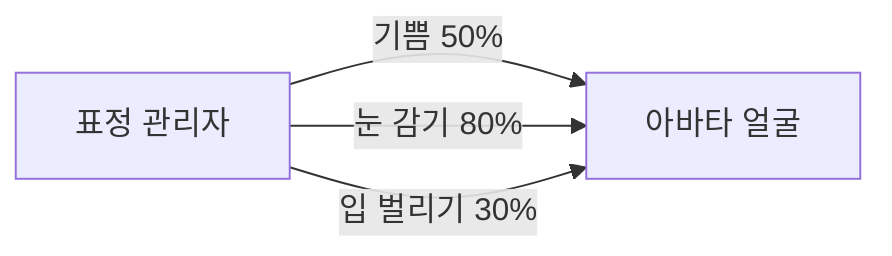
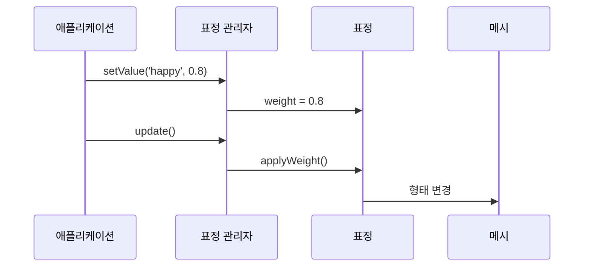

# Chapter 5: 표정 관리자 (VRMExpression/VRMExpressionManager)

[이전 장](04_툰_셰이더_재질__mtoonmaterial__.md)에서 아바타를 애니메이션처럼 예쁘게 렌더링하는 방법을 배웠습니다. 이제 아바타에 생명을 불어넣는 가장 중요한 요소 중 하나인 **표정 관리자**에 대해 알아보겠습니다!

## 왜 표정 관리자가 필요할까요?

여러분이 메신저에서 이모티콘을 사용하는 것을 생각해보세요. 😊 😢 😡 같은 이모티콘으로 감정을 표현하죠? 3D 아바타도 마찬가지입니다!

하지만 3D 아바타의 표정은 훨씬 복잡합니다:

- 눈을 반쯤 감거나 완전히 감기
- 입을 '아' 또는 '오' 모양으로 만들기
- 눈썹을 올리거나 내리기
- 여러 표정을 섞어서 자연스럽게 만들기

**표정 관리자**는 이 모든 것을 쉽게 제어할 수 있게 해주는 **리모콘**과 같습니다!



## 표정의 구성 요소

### 표정(VRMExpression)이란?

**VRMExpression**은 하나의 표정을 나타냅니다. 각 표정은 0에서 1 사이의 **가중치(weight)**를 가집니다:

- `0.0` = 표정 없음
- `0.5` = 표정 반만 적용
- `1.0` = 표정 완전히 적용

### 프리셋 표정들

VRM은 자주 사용하는 표정들을 미리 정의해두었습니다:

```javascript
// 감정 표현
"happy"; // 😊 기쁨
"angry"; // 😡 화남
"sad"; // 😢 슬픔
"relaxed"; // 😌 편안함
"surprised"; // 😮 놀람

// 눈 관련
"blink"; // 👁️ 양쪽 눈 감기
"blinkLeft"; // 왼쪽 눈만 감기
"blinkRight"; // 오른쪽 눈만 감기

// 입 모양 (일본어 모음)
"aa"; // あ
"ih"; // い
"ou"; // う
"ee"; // え
"oh"; // お
```

## 표정 관리자 사용하기

### 1단계: 표정 확인하기

```javascript
// 사용 가능한 표정 목록 보기
const expressions = vrm.expressionManager.expressions;
console.log("표정 개수:", expressions.length);

// 프리셋 표정만 보기
const presets = vrm.expressionManager.presetExpressionMap;
console.log("기쁨 표정:", presets.happy);
```

### 2단계: 표정 적용하기

```javascript
// 완전히 웃는 표정
vrm.expressionManager.setValue("happy", 1.0);

// 살짝 웃는 표정
vrm.expressionManager.setValue("happy", 0.3);

// 표정 초기화
vrm.expressionManager.setValue("happy", 0.0);
```

`setValue`로 표정의 강도를 조절할 수 있습니다!

### 3단계: 여러 표정 섞기

```javascript
// 웃으면서 한쪽 눈 윙크
vrm.expressionManager.setValue("happy", 0.7);
vrm.expressionManager.setValue("blinkLeft", 1.0);
```

여러 표정을 동시에 적용하면 더 자연스러운 표현이 가능합니다!

### 4단계: 표정 애니메이션

```javascript
let time = 0;
function animateExpression() {
  time += 0.01;

  // 눈 깜빡이기
  const blinkValue = Math.sin(time * 5) > 0.9 ? 1 : 0;
  vrm.expressionManager.setValue("blink", blinkValue);

  requestAnimationFrame(animateExpression);
}
```

시간에 따라 표정을 변화시켜 생동감 있는 아바타를 만들 수 있습니다!

## 표정 오버라이드 시스템

### 오버라이드란?

때로는 특정 표정이 다른 표정을 **차단**해야 할 때가 있습니다. 예를 들어:

- 눈을 감고 있을 때는 시선 추적이 작동하면 안 됩니다
- '아' 하고 입을 벌릴 때는 '우' 모양이 나오면 안 됩니다

### 오버라이드 설정

```javascript
const expression = vrm.expressionManager.getExpression("happy");

// 기쁨 표정이 눈 깜빡임을 차단
expression.overrideBlink = "block";

// 기쁨 표정이 시선을 부분적으로 제한
expression.overrideLookAt = "blend";
```

오버라이드 타입:

- `'none'`: 영향 없음
- `'block'`: 완전히 차단
- `'blend'`: 부분적으로 영향

## 내부 동작 원리

표정 관리자가 어떻게 동작하는지 살펴보겠습니다.

### 업데이트 과정



### 가중치 계산

표정 관리자는 오버라이드를 고려해 최종 가중치를 계산합니다:

```javascript
// 가중치 계산 (간략화)
_calculateWeightMultipliers() {
    let blink = 1.0;

    // 각 표정의 오버라이드 양 계산
    this._expressions.forEach(expression => {
        blink -= expression.overrideBlinkAmount;
    });

    return { blink: Math.max(0, blink) };
}
```

눈 깜빡임이 다른 표정에 의해 얼마나 제한되는지 계산합니다.

### 모프 타겟 바인딩

표정은 실제로 메시의 **모프 타겟**을 조작합니다:

```javascript
// 모프 타겟 적용 (간략화)
applyWeight(weight) {
    this.primitives.forEach(mesh => {
        // 메시의 형태를 변경
        mesh.morphTargetInfluences[this.index] +=
            this.weight * weight;
    });
}
```

모프 타겟은 메시의 정점을 이동시켜 형태를 바꿉니다!

### 표정 등록 과정

새로운 표정이 등록될 때의 과정입니다:

```javascript
// 표정 등록 (간략화)
registerExpression(expression) {
    // 배열에 추가
    this._expressions.push(expression);

    // 이름으로 빠르게 찾을 수 있게 맵에 저장
    this._expressionMap[expression.expressionName] = expression;
}
```

이름으로 표정을 빠르게 찾을 수 있도록 맵을 사용합니다.

## 실전 예제: 감정 시스템 만들기

배운 내용을 활용해 간단한 감정 시스템을 만들어보겠습니다:

```javascript
// 감정 상태
const emotions = {
  joy: 0,
  anger: 0,
  sadness: 0,
};

// 감정을 표정으로 변환
function updateExpressions() {
  const em = vrm.expressionManager;

  em.setValue("happy", emotions.joy);
  em.setValue("angry", emotions.anger);
  em.setValue("sad", emotions.sadness);
}
```

```javascript
// 상황에 따른 감정 변화
function onPlayerWin() {
  emotions.joy = 1.0;
  emotions.anger = 0.0;
  emotions.sadness = 0.0;
  updateExpressions();
}

function onPlayerLose() {
  emotions.joy = 0.0;
  emotions.anger = 0.3;
  emotions.sadness = 0.7;
  updateExpressions();
}
```

이렇게 하면 게임 상황에 따라 아바타가 적절한 감정을 표현합니다!

## 정리

이번 장에서는 표정 관리자에 대해 배웠습니다:

- 표정 관리자는 아바타의 얼굴 표정을 제어하는 리모콘입니다
- 각 표정은 0에서 1 사이의 가중치로 강도를 조절합니다
- 프리셋 표정과 커스텀 표정을 모두 사용할 수 있습니다
- 여러 표정을 섞어서 자연스러운 표현이 가능합니다
- 오버라이드 시스템으로 표정 간 충돌을 방지합니다

이제 아바타가 다양한 감정을 표현할 수 있게 되었습니다! 다음 장에서는 아바타의 눈이 특정 대상을 바라보게 하는 [시선 추적 시스템](06_시선_추적_시스템__vrmlookat__.md)에 대해 알아보겠습니다.

---

Generated by [AI Codebase Knowledge Builder](https://github.com/The-Pocket/Tutorial-Codebase-Knowledge)
