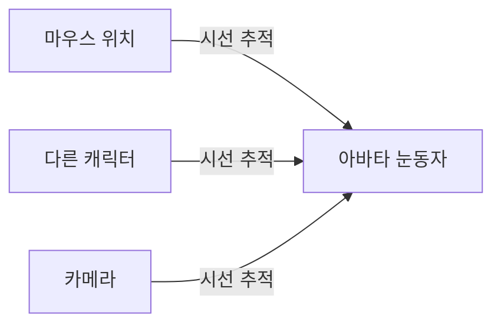
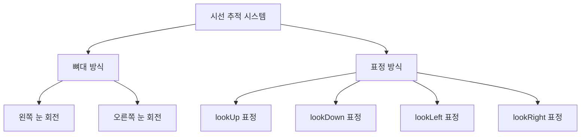
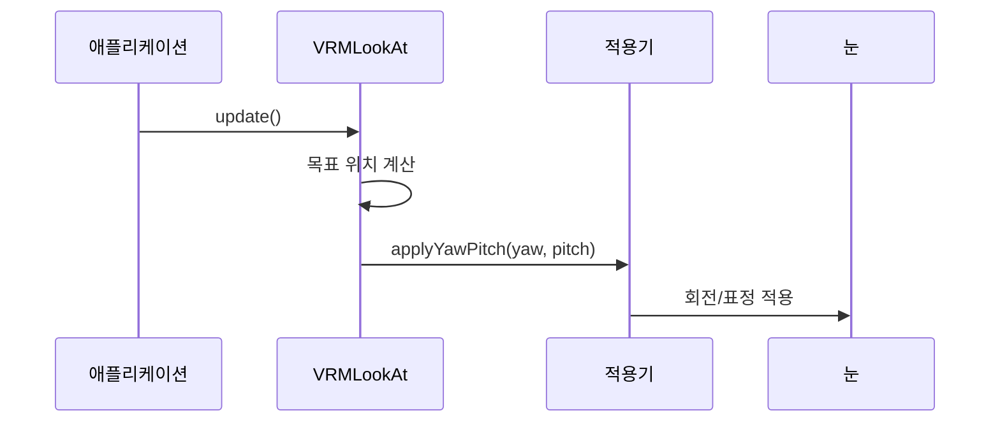

# Chapter 6: 시선 추적 시스템 (VRMLookAt)

[이전 장](05_표정_관리자__vrmexpression_vrmexpressionmanager__.md)에서 아바타의 다양한 표정을 만드는 방법을 배웠습니다. 이제 아바타가 정말 살아있는 것처럼 느껴지게 만드는 핵심 기능인 **시선 추적 시스템**에 대해 알아보겠습니다!

## 왜 시선 추적이 필요할까요?

여러분이 친구와 대화할 때를 생각해보세요. 친구가 여러분을 바라보지 않고 딴 곳을 보고 있다면 어색하겠죠? 반대로 친구가 여러분의 눈을 바라보며 이야기한다면 훨씬 자연스럽고 친근하게 느껴집니다.

3D 아바타도 마찬가지입니다! 아바타가 사용자나 특정 대상을 바라보게 만들면:

- 대화하는 느낌이 들어요
- 살아있는 것처럼 보여요
- 무엇에 관심이 있는지 표현할 수 있어요

**VRMLookAt**은 아바타의 눈과 머리를 자연스럽게 움직여서 특정 대상을 바라보게 만드는 시스템입니다!



## 시선 추적의 두 가지 방식

VRM은 시선을 표현하는 두 가지 방법을 제공합니다:

### 1. 뼈대 방식 (Bone)

실제로 눈알을 회전시켜서 시선을 표현합니다. 마치 인형의 눈알을 돌리는 것과 같아요!

### 2. 표정 방식 (Expression)

눈 모양을 바꿔서 시선을 표현합니다. 2D 애니메이션처럼 그려진 눈을 사용하는 경우에 적합해요!



## 시선 추적 사용하기

이제 실제로 아바타의 시선을 제어해보겠습니다!

### 1단계: 시선 추적 가져오기

```javascript
// VRM의 시선 추적 시스템 가져오기
const lookAt = vrm.lookAt;
console.log("시선 방식:", lookAt.applier.type);
```

VRM을 불러오면 자동으로 시선 추적 시스템이 설정됩니다!

### 2단계: 특정 위치 바라보기

```javascript
// 특정 위치 바라보게 하기
const targetPosition = new THREE.Vector3(2, 1.5, 3);
lookAt.lookAt(targetPosition);
```

`lookAt` 메서드로 원하는 위치를 바라보게 할 수 있습니다!

### 3단계: 자동 추적 설정

```javascript
// 자동으로 대상 추적하기
const cube = new THREE.Mesh(geometry, material);
scene.add(cube);

// 큐브를 계속 바라보도록 설정
lookAt.target = cube;
lookAt.autoUpdate = true;
```

`target`을 설정하면 아바타가 자동으로 대상을 계속 바라봅니다!

### 4단계: 수동으로 각도 조절

```javascript
// 좌우 회전 (Yaw) - 도 단위
lookAt.yaw = 30; // 오른쪽 바라보기

// 상하 회전 (Pitch) - 도 단위
lookAt.pitch = -15; // 위쪽 바라보기
```

각도를 직접 설정할 수도 있습니다!

## 시선 범위 설정

아바타의 눈이 너무 많이 돌아가면 부자연스러워요. 시선 범위를 제한해봅시다:

### 범위 맵 이해하기

```javascript
// 시선 범위 가져오기
const applier = lookAt.applier;
const horizontalOuter = applier.rangeMapHorizontalOuter;

console.log("최대 각도:", horizontalOuter.inputMaxValue);
console.log("출력 스케일:", horizontalOuter.outputScale);
```

각 방향마다 최대 각도와 출력 강도를 설정할 수 있습니다.

### 범위 조절하기

```javascript
// 좌우 시선 범위 넓히기
applier.rangeMapHorizontalOuter.inputMaxValue = 90;

// 상하 시선 범위 줄이기
applier.rangeMapVerticalUp.inputMaxValue = 20;
```

이렇게 하면 좌우로는 많이, 상하로는 조금만 움직입니다!

## 내부 동작 원리

시선 추적 시스템이 어떻게 동작하는지 살펴보겠습니다.

### 업데이트 과정



### 각도 계산 과정

시선 추적은 목표 위치를 각도로 변환합니다:

```javascript
// lookAt 메서드 내부 (간략화)
lookAt(position) {
    // 1. 머리에서 목표까지의 방향 계산
    const headPos = this.getLookAtWorldPosition();
    const lookDir = position.sub(headPos).normalize();

    // 2. 방향을 각도로 변환
    const yaw = Math.atan2(lookDir.x, lookDir.z);
    const pitch = Math.asin(lookDir.y);
}
```

3D 공간의 위치를 좌우(yaw)와 상하(pitch) 각도로 변환합니다!

### 뼈대 방식 적용

```javascript
// VRMLookAtBoneApplier 내부 (간략화)
applyYawPitch(yaw, pitch) {
    const leftEye = humanoid.getRawBoneNode('leftEye');

    // 각도를 쿼터니언으로 변환
    euler.set(pitch, yaw, 0, 'YXZ');
    quaternion.setFromEuler(euler);

    // 눈 뼈대에 회전 적용
    leftEye.quaternion.copy(quaternion);
}
```

각도를 실제 눈 뼈대의 회전으로 적용합니다!

### 표정 방식 적용

```javascript
// VRMLookAtExpressionApplier 내부 (간략화)
applyYawPitch(yaw, pitch) {
    // 상하 시선
    if (pitch < 0) {
        expressions.setValue('lookUp', -pitch);
    } else {
        expressions.setValue('lookDown', pitch);
    }

    // 좌우 시선
    if (yaw < 0) {
        expressions.setValue('lookRight', -yaw);
    } else {
        expressions.setValue('lookLeft', yaw);
    }
}
```

각도를 표정의 강도로 변환해서 적용합니다!

## 실전 예제: 마우스 따라보기

배운 내용을 활용해 마우스를 따라보는 아바타를 만들어보겠습니다:

```javascript
// 마우스 위치를 3D 공간으로 변환
const mouse = new THREE.Vector2();
const targetPos = new THREE.Vector3();

window.addEventListener("mousemove", (event) => {
  mouse.x = (event.clientX / window.innerWidth) * 2 - 1;
  mouse.y = -(event.clientY / window.innerHeight) * 2 + 1;
});
```

```javascript
// 애니메이션 루프
function animate() {
  // 마우스 위치를 3D 좌표로 변환
  targetPos.set(mouse.x * 3, mouse.y * 2 + 1.5, 2);

  // 아바타가 마우스 위치 바라보기
  vrm.lookAt.lookAt(targetPos);

  // VRM 업데이트
  vrm.update(deltaTime);

  requestAnimationFrame(animate);
}
```

이제 아바타가 마우스 커서를 따라 시선을 움직입니다!

## 정리

이번 장에서는 시선 추적 시스템(VRMLookAt)에 대해 배웠습니다:

- 시선 추적은 아바타가 특정 대상을 바라보게 만드는 시스템입니다
- 뼈대 방식과 표정 방식 두 가지를 지원합니다
- 특정 위치나 오브젝트를 자동으로 추적할 수 있습니다
- 시선 범위를 조절해서 자연스러운 움직임을 만들 수 있습니다
- 내부적으로 3D 위치를 각도로 변환해서 적용합니다

이제 아바타가 생생하게 주변을 바라볼 수 있게 되었습니다! 다음 장에서는 머리카락이나 옷자락이 자연스럽게 흔들리게 만드는 [스프링본 물리 시스템](07_스프링본_물리_시스템__vrmspringbone__.md)에 대해 알아보겠습니다.

---

Generated by [AI Codebase Knowledge Builder](https://github.com/The-Pocket/Tutorial-Codebase-Knowledge)
