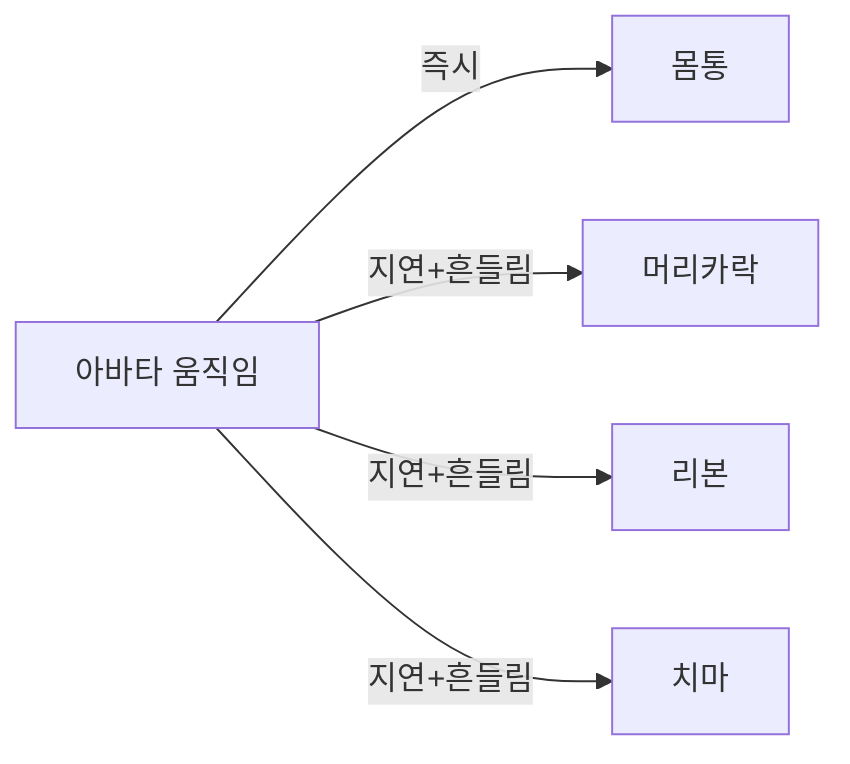
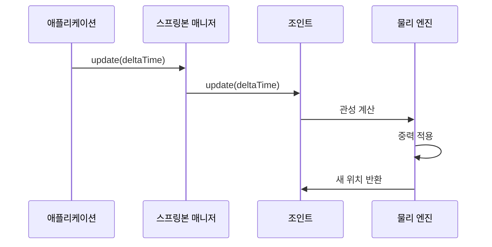

# Chapter 7: 스프링본 물리 시스템 (VRMSpringBone)

[이전 장](06_시선_추적_시스템__vrmlookat__.md)에서 아바타의 시선이 자연스럽게 대상을 따라가도록 만드는 방법을 배웠습니다. 이제 아바타를 더욱 생생하게 만드는 마법 같은 기능인 **스프링본 물리 시스템**에 대해 알아보겠습니다!

## 왜 스프링본이 필요할까요?

여러분이 빠르게 고개를 돌릴 때 머리카락이 어떻게 움직이는지 생각해보세요. 머리는 즉시 돌아가지만, 머리카락은 살짝 늦게 따라오면서 자연스럽게 흔들리죠? 치마를 입고 뛰면 치맛자락이 펄럭이고, 목걸이는 움직임에 따라 흔들립니다.

일반적인 3D 모델에서는 이런 부분들이 몸과 함께 딱딱하게 움직입니다:

```
몸이 움직임 → 머리카락도 즉시 같이 움직임 (부자연스러움!)
```

하지만 현실에서는 이렇게 움직입니다:

```
몸이 움직임 → 머리카락은 잠시 뒤에 → 흔들리면서 따라옴 (자연스러움!)
```

**스프링본 시스템**은 이런 자연스러운 물리 움직임을 시뮬레이션합니다. 마치 머리카락이나 옷자락에 작은 용수철(스프링)들이 달려있는 것처럼 만들어주죠!



## 스프링본의 구성 요소

스프링본 시스템은 세 가지 주요 구성 요소로 이루어져 있습니다:

### 1. 조인트 (Joint)

**조인트**는 흔들리는 각 부분의 관절입니다. 머리카락의 각 마디, 리본의 각 부분이 하나의 조인트가 됩니다.

```
머리 → [조인트1] → [조인트2] → [조인트3] → 머리카락 끝
```

### 2. 충돌체 (Collider)

**충돌체**는 스프링본이 몸을 뚫고 들어가지 않도록 막아주는 보이지 않는 벽입니다. 머리카락이 머리나 어깨를 뚫고 들어가면 이상하겠죠?

### 3. 매니저 (Manager)

**매니저**는 모든 스프링본을 관리하는 지휘자입니다. 언제 어떤 순서로 업데이트할지 결정합니다.

## 스프링본 사용하기

이제 실제로 스프링본을 설정하고 사용해보겠습니다!

### 1단계: 스프링본 확인하기

```javascript
// VRM의 스프링본 매니저 가져오기
const springBoneManager = vrm.springBoneManager;
console.log("스프링본 개수:", springBoneManager.joints.size);
```

VRM을 불러오면 자동으로 스프링본이 설정되어 있습니다!

### 2단계: 스프링본 설정 조정하기

```javascript
// 모든 스프링본 조인트 가져오기
const joints = Array.from(springBoneManager.joints);

// 첫 번째 조인트의 설정 변경
const firstJoint = joints[0];
firstJoint.settings.stiffness = 2.0; // 더 뻣뻣하게
```

`stiffness`는 스프링의 강도입니다. 값이 클수록 빨리 원래 위치로 돌아옵니다!

### 3단계: 중력 설정하기

```javascript
// 중력 방향과 강도 설정
firstJoint.settings.gravityDir = new THREE.Vector3(0, -1, 0);
firstJoint.settings.gravityPower = 1.5;
```

중력을 설정하면 머리카락이나 옷이 자연스럽게 아래로 처집니다!

### 4단계: 저항력 조절하기

```javascript
// 공기 저항 설정 (0 ~ 1)
firstJoint.settings.dragForce = 0.3; // 적당한 저항
```

`dragForce`는 움직임을 얼마나 빨리 멈추게 할지 결정합니다. 물속에서처럼 천천히 움직이게 하려면 값을 높이세요!

## 충돌 설정하기

스프링본이 몸을 뚫고 들어가지 않도록 충돌체를 설정해봅시다:

### 충돌체 만들기

```javascript
// 구형 충돌체 만들기
const colliderShape = new VRMSpringBoneColliderShapeSphere({
  radius: 0.1, // 반지름
  offset: new THREE.Vector3(0, 0, 0), // 위치 오프셋
});
```

### 충돌체 배치하기

```javascript
// 충돌체를 머리에 부착
const collider = new VRMSpringBoneCollider(colliderShape);
vrm.humanoid.getRawBoneNode("head").add(collider);
```

충돌체를 머리에 부착하면 머리카락이 머리를 뚫지 않습니다!

### 충돌 그룹 만들기

```javascript
// 충돌 그룹 생성
const colliderGroup = {
  colliders: [collider],
};

// 조인트에 충돌 그룹 연결
firstJoint.colliderGroups = [colliderGroup];
```

이제 스프링본이 충돌체와 상호작용합니다!

## 내부 동작 원리

스프링본이 어떻게 자연스러운 움직임을 만드는지 살펴보겠습니다.

### 물리 시뮬레이션 과정



### 버렛 적분 (Verlet Integration)

스프링본은 **버렛 적분**이라는 방법으로 움직임을 계산합니다:

```javascript
// 다음 위치 계산 (간략화)
_nextTail
  // 현재 위치 + (현재 - 이전) * 관성
  .copy(currentTail)
  .add(currentTail - prevTail * (1 - dragForce))
  // 스프링 힘 적용
  .addScaledVector(boneAxis, stiffness * delta)
  // 중력 적용
  .addScaledVector(gravityDir, gravityPower * delta);
```

이 방법은 이전 프레임의 움직임을 기억해서 자연스러운 관성을 만듭니다!

### 충돌 처리

충돌은 다음과 같이 처리됩니다:

```javascript
// 충돌 검사 (간략화)
const distance = collider.calculateCollision(
  tail, // 스프링본 끝 위치
  hitRadius, // 충돌 반경
);

if (distance < 0) {
  // 충돌! 밖으로 밀어냄
  tail.addScaledVector(direction, -distance);
}
```

충돌체 안으로 들어가면 바깥으로 밀어내서 자연스러운 충돌을 표현합니다!

### 업데이트 순서 관리

스프링본 매니저는 의존성을 고려해 올바른 순서로 업데이트합니다:

```javascript
// 업데이트 순서 정렬 (간략화)
_sortJoints() {
    // 부모 조인트부터 자식 조인트 순서로 정렬
    // 의존성 있는 조인트는 나중에 업데이트
}
```

부모가 먼저 움직이고 자식이 따라가도록 순서를 보장합니다!

## 실전 예제: 바람 효과 만들기

배운 내용을 활용해 바람에 흔들리는 효과를 만들어보겠습니다:

```javascript
// 바람 설정
const windDirection = new THREE.Vector3(1, 0, 0);
const windStrength = 0.5;
let windTime = 0;
```

```javascript
// 애니메이션 루프에서
function animate() {
  windTime += 0.02;

  // 바람 강도 변화
  const currentWind = Math.sin(windTime) * windStrength;

  // 모든 조인트에 바람 적용
  springBoneManager.joints.forEach((joint) => {
    joint.settings.gravityDir = new THREE.Vector3(
      windDirection.x * currentWind,
      -1, // 기본 중력
      windDirection.z * currentWind,
    );
  });

  // 스프링본 업데이트
  springBoneManager.update(deltaTime);
}
```

이렇게 하면 머리카락과 옷이 바람에 자연스럽게 흔들립니다!

## 정리

이번 장에서는 스프링본 물리 시스템에 대해 배웠습니다:

- 스프링본은 머리카락, 옷자락 등의 자연스러운 물리 움직임을 만듭니다
- 조인트, 충돌체, 매니저로 구성되어 있습니다
- 스프링 강도, 중력, 저항력을 조절할 수 있습니다
- 충돌체로 몸을 뚫고 들어가는 것을 방지합니다
- 버렛 적분으로 자연스러운 관성을 표현합니다

이제 아바타의 머리카락과 옷이 살아있는 것처럼 움직입니다! 다음 장에서는 아바타에 복잡한 움직임을 적용하는 [애니메이션 시스템](08_애니메이션_시스템__vrmanimation__.md)에 대해 알아보겠습니다.

---

Generated by [AI Codebase Knowledge Builder](https://github.com/The-Pocket/Tutorial-Codebase-Knowledge)
