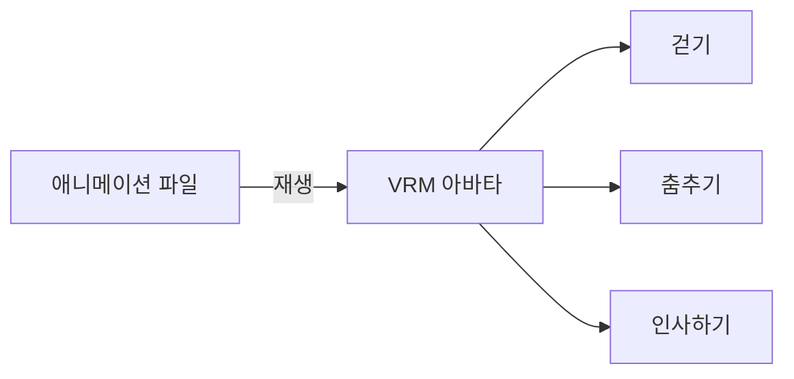
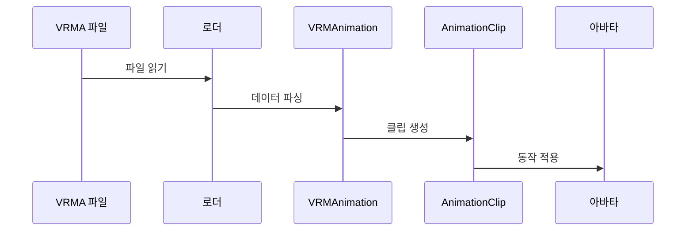

# Chapter 8: 애니메이션 시스템 (VRMAnimation)

[이전 장](07_스프링본_물리_시스템__vrmspringbone__.md)에서 아바타의 머리카락과 옷이 자연스럽게 흔들리도록 만드는 방법을 배웠습니다. 이제 아바타가 실제로 움직이고 춤추게 만드는 가장 흥미로운 기능인 **애니메이션 시스템**에 대해 알아보겠습니다!

## 왜 애니메이션 시스템이 필요할까요?

여러분이 좋아하는 게임이나 영화의 캐릭터를 떠올려보세요. 캐릭터가 걷고, 뛰고, 춤추고, 손을 흔들죠? 지금까지 우리는 아바타의 표정을 바꾸고, 시선을 움직이고, 머리카락을 흔들리게 만들었지만, 아직 아바타가 실제로 **움직이지**는 않습니다!

만약 아바타가 춤을 춘다고 생각해보세요:

- 0초: 양팔을 올린다
- 0.5초: 왼쪽으로 몸을 돌린다
- 1초: 기쁜 표정을 짓는다
- 1.5초: 다시 원래 자세로 돌아온다

이런 복잡한 동작을 코드로 직접 만들려면 엄청나게 어려울 것입니다. **VRMAnimation**은 이런 동작들을 미리 녹화해두고 재생할 수 있게 해주는 **동영상 플레이어**와 같습니다!



## 애니메이션의 구성 요소

### 트랙 (Track)이란?

애니메이션은 여러 개의 **트랙**으로 구성됩니다. 각 트랙은 하나의 악기 연주와 같아요:

```
🎸 왼팔 트랙:    0초[내림] → 1초[올림] → 2초[내림]
🥁 오른팔 트랙:  0초[올림] → 1초[내림] → 2초[올림]
🎹 표정 트랙:    0초[무표정] → 1초[웃음] → 2초[무표정]
```

모든 트랙이 함께 연주되면 완전한 애니메이션이 됩니다!

### 키프레임 (Keyframe)

각 트랙은 **키프레임**이라는 중요한 순간들로 이루어져 있습니다:

```javascript
// 시간과 값의 쌍
키프레임 = {
  시간: 1.5, // 1.5초
  값: 팔_위로_올림, // 동작
};
```

애니메이션 시스템은 키프레임 사이를 자동으로 부드럽게 연결해줍니다!

## 애니메이션 사용하기

이제 실제로 애니메이션을 불러오고 재생해보겠습니다!

### 1단계: 애니메이션 파일 불러오기

```javascript
import { VRMAnimationLoaderPlugin } from "@pixiv/three-vrm-animation";

// 애니메이션 로더 설정
const loader = new GLTFLoader();
loader.register((parser) => {
  return new VRMAnimationLoaderPlugin(parser);
});
```

VRM 로더처럼 애니메이션도 플러그인을 등록해야 합니다!

### 2단계: 애니메이션 불러오기

```javascript
// 애니메이션 파일 불러오기
loader.load("dance.vrma", (gltf) => {
  const vrmAnimations = gltf.userData.vrmAnimations;
  console.log("애니메이션 개수:", vrmAnimations.length);
});
```

`.vrma` 파일에는 하나 이상의 애니메이션이 들어있을 수 있습니다!

### 3단계: 애니메이션 클립 만들기

```javascript
import { createVRMAnimationClip } from "@pixiv/three-vrm-animation";

// VRM 아바타에 맞는 클립 생성
const clip = createVRMAnimationClip(vrmAnimations[0], vrm);
console.log("클립 길이:", clip.duration, "초");
```

`createVRMAnimationClip`은 애니메이션을 아바타에 맞게 변환합니다!

### 4단계: 애니메이션 재생하기

```javascript
// 애니메이션 믹서 생성
const mixer = new THREE.AnimationMixer(vrm.scene);

// 애니메이션 재생
const action = mixer.clipAction(clip);
action.play();
```

이제 애니메이션이 재생됩니다!

### 5단계: 애니메이션 업데이트

```javascript
// 애니메이션 루프
function animate() {
  const deltaTime = clock.getDelta();

  mixer.update(deltaTime); // 애니메이션 업데이트
  vrm.update(deltaTime); // VRM 업데이트

  requestAnimationFrame(animate);
}
```

매 프레임마다 믹서를 업데이트해야 애니메이션이 진행됩니다!

## 애니메이션 제어하기

### 재생 속도 조절

```javascript
// 2배속으로 재생
action.timeScale = 2.0;

// 0.5배속으로 재생 (슬로우모션)
action.timeScale = 0.5;
```

`timeScale`로 애니메이션 속도를 조절할 수 있습니다!

### 반복 설정

```javascript
// 한 번만 재생
action.setLoop(THREE.LoopOnce);

// 무한 반복
action.setLoop(THREE.LoopRepeat);
```

춤은 계속 반복하고, 인사는 한 번만 하도록 설정할 수 있습니다!

## 내부 동작 원리

애니메이션 시스템이 어떻게 동작하는지 살펴보겠습니다.

### 애니메이션 데이터 구조



### VRMAnimation 구조

VRMAnimation은 다음과 같은 데이터를 저장합니다:

```javascript
class VRMAnimation {
    // 애니메이션 길이 (초)
    duration = 3.5;

    // 휴머노이드 트랙 (관절 움직임)
    humanoidTracks = {
        rotation: Map<'leftUpperArm', Track>,
        translation: Map<'hips', Track>
    };

    // 표정 트랙
    expressionTracks = {
        preset: Map<'happy', Track>
    };
}
```

각 트랙은 시간에 따른 값의 변화를 저장합니다!

### 트랙에서 클립으로 변환

```javascript
// createVRMAnimationClip 내부 (간략화)
function createClip(animation, vrm) {
  const tracks = [];

  // 휴머노이드 트랙 변환
  for (const [bone, track] of animation.humanoidTracks) {
    const node = vrm.humanoid.getBoneNode(bone);
    tracks.push(convertTrack(track, node));
  }

  return new THREE.AnimationClip("춤", duration, tracks);
}
```

VRM의 실제 뼈대와 애니메이션 데이터를 연결합니다!

### 시선 애니메이션

시선도 애니메이션으로 제어할 수 있습니다:

```javascript
// 시선 프록시 생성
const lookAtProxy = new VRMLookAtQuaternionProxy(vrm.lookAt);
vrm.scene.add(lookAtProxy);

// 시선 트랙이 프록시를 제어
lookAtTrack.name = `${lookAtProxy.name}.quaternion`;
```

프록시를 통해 시선 각도를 쿼터니언으로 제어합니다!

## 실전 예제: 댄스 파티 만들기

배운 내용을 활용해 여러 애니메이션을 섞어보겠습니다:

```javascript
// 여러 애니메이션 불러오기
const animations = {
  idle: await loadAnimation("idle.vrma"),
  dance: await loadAnimation("dance.vrma"),
  wave: await loadAnimation("wave.vrma"),
};
```

```javascript
// 상황에 따라 애니메이션 전환
let currentAction = null;

function playAnimation(name) {
  // 이전 애니메이션 페이드아웃
  if (currentAction) {
    currentAction.fadeOut(0.5);
  }

  // 새 애니메이션 페이드인
  const clip = animations[name];
  currentAction = mixer.clipAction(clip);
  currentAction.fadeIn(0.5).play();
}
```

이렇게 하면 부드럽게 애니메이션이 전환됩니다!

## 정리

이번 장에서는 애니메이션 시스템(VRMAnimation)에 대해 배웠습니다:

- 애니메이션은 시간에 따른 동작을 녹화한 데이터입니다
- 트랙과 키프레임으로 구성되어 있습니다
- AnimationMixer로 애니메이션을 재생할 수 있습니다
- 속도, 반복, 전환 등을 자유롭게 제어할 수 있습니다
- 휴머노이드, 표정, 시선을 모두 애니메이션으로 제어할 수 있습니다

이제 아바타가 실제로 움직이고 춤출 수 있게 되었습니다! 다음 장에서는 아바타의 움직임을 더욱 정교하게 제어하는 [노드 제약 시스템](09_노드_제약_시스템__vrmnodeconstraint__.md)에 대해 알아보겠습니다.

---

Generated by [AI Codebase Knowledge Builder](https://github.com/The-Pocket/Tutorial-Codebase-Knowledge)
