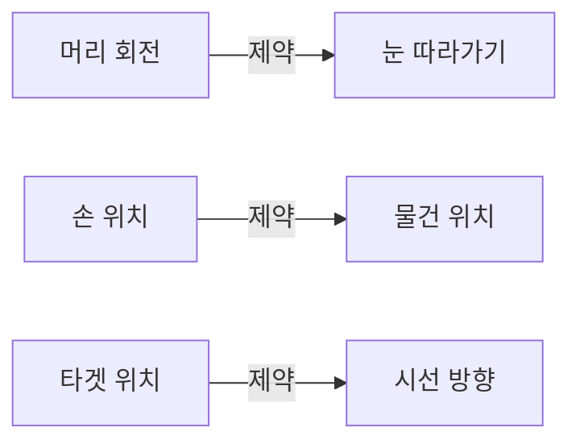
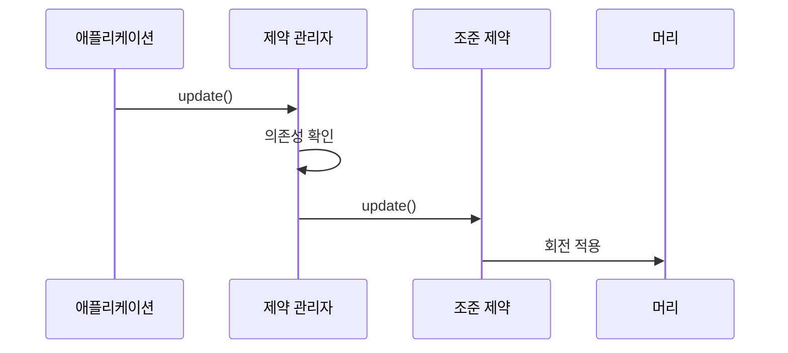

# Chapter 9: 노드 제약 시스템 (VRMNodeConstraint)

[이전 장](08_애니메이션_시스템__vrmanimation__.md)에서 아바타가 실제로 움직이고 춤추게 만드는 애니메이션 시스템을 배웠습니다. 이제 아바타의 움직임을 더욱 자연스럽고 정교하게 만들어주는 마법 같은 기능인 **노드 제약 시스템**에 대해 알아보겠습니다!

## 왜 노드 제약이 필요할까요?

여러분이 인형극을 본 적이 있나요? 인형사가 실을 당기면 인형의 팔이 움직이고, 머리를 돌리면 눈도 같이 따라가죠. 또는 자동차의 바퀴를 생각해보세요. 핸들을 돌리면 앞바퀴가 같이 돌아갑니다.

3D 아바타에서도 비슷한 상황이 많습니다:

- 캐릭터가 무언가를 바라볼 때 눈뿐만 아니라 머리도 함께 돌아야 자연스러워요
- 어깨를 으쓱하면 팔도 따라 올라가야 해요
- 물건을 들고 있으면 손이 물건을 계속 따라가야 해요

**노드 제약 시스템**은 이런 연결된 움직임을 자동으로 만들어주는 **끈**과 같습니다!



## 제약의 종류

노드 제약 시스템은 크게 두 가지 제약을 제공합니다:

### 1. 조준 제약 (Aim Constraint)

**조준 제약**은 한 객체가 다른 객체를 바라보도록 만듭니다. 마치 해바라기가 태양을 따라 돌듯이요!

```
🌻 해바라기(destination) → ☀️ 태양(source) 바라보기
```

### 2. 회전 제약 (Rotation Constraint)

**회전 제약**은 한 객체의 회전을 다른 객체에 복사합니다. 마치 톱니바퀴처럼요!

```
⚙️ 톱니1(source) 회전 → ⚙️ 톱니2(destination)도 같이 회전
```

## 제약 시스템 사용하기

이제 실제로 제약을 만들고 사용해보겠습니다!

### 1단계: 조준 제약 만들기

```javascript
import { VRMAimConstraint } from "@pixiv/three-vrm-node-constraint";

// 머리가 공을 바라보도록 설정
const head = vrm.humanoid.getRawBoneNode("head");
const ball = new THREE.Mesh(geometry, material);

const aimConstraint = new VRMAimConstraint(head, ball);
```

`VRMAimConstraint`로 머리(destination)가 공(source)을 바라보도록 만들었습니다!

### 2단계: 조준 축 설정하기

```javascript
// 머리의 정면(+Z)이 공을 향하도록
aimConstraint.aimAxis = "PositiveZ";

// 가능한 축 방향들:
// 'PositiveX', 'NegativeX' (좌우)
// 'PositiveY', 'NegativeY' (상하)
// 'PositiveZ', 'NegativeZ' (앞뒤)
```

어느 방향이 "앞"인지 설정해야 올바르게 바라봅니다!

### 3단계: 제약 강도 조절하기

```javascript
// 완전히 바라보기 (100%)
aimConstraint.weight = 1.0;

// 절반만 바라보기 (50%)
aimConstraint.weight = 0.5;
```

`weight`로 얼마나 강하게 제약을 적용할지 조절할 수 있습니다!

### 4단계: 회전 제약 만들기

```javascript
import { VRMRotationConstraint } from "@pixiv/three-vrm-node-constraint";

// 왼팔이 오른팔 움직임을 따라하도록
const leftArm = vrm.humanoid.getRawBoneNode("leftUpperArm");
const rightArm = vrm.humanoid.getRawBoneNode("rightUpperArm");

const rotConstraint = new VRMRotationConstraint(leftArm, rightArm);
```

이제 오른팔을 움직이면 왼팔도 같이 움직입니다!

## 제약 관리자 사용하기

여러 제약을 효율적으로 관리하려면 **제약 관리자**를 사용합니다:

### 제약 관리자 설정

```javascript
import { VRMNodeConstraintManager } from "@pixiv/three-vrm-node-constraint";

// 제약 관리자 생성
const constraintManager = new VRMNodeConstraintManager();

// 제약 추가
constraintManager.addConstraint(aimConstraint);
constraintManager.addConstraint(rotConstraint);
```

### 초기 상태 설정

```javascript
// 현재 상태를 기준점으로 저장
constraintManager.setInitState();
```

제약을 적용하기 전의 상태를 기억해둡니다!

### 제약 업데이트

```javascript
// 애니메이션 루프에서
function animate() {
  // 제약 업데이트
  constraintManager.update();

  requestAnimationFrame(animate);
}
```

매 프레임마다 모든 제약을 자동으로 적용합니다!

## 내부 동작 원리

제약 시스템이 어떻게 움직임을 연결하는지 살펴보겠습니다.

### 업데이트 순서



### 의존성 관리

제약은 서로 의존할 수 있습니다:

```javascript
// VRMNodeConstraintManager 내부 (간략화)
_processConstraint(constraint) {
    // 이 제약이 의존하는 객체들 확인
    const dependencies = constraint.dependencies;

    // 의존하는 제약들을 먼저 업데이트
    for (const dep of dependencies) {
        updateDependentConstraints(dep);
    }

    // 그 다음 이 제약 업데이트
    constraint.update();
}
```

부모가 먼저 움직이고 자식이 따라가도록 순서를 보장합니다!

### 조준 제약의 계산

조준 제약이 어떻게 바라보는 방향을 계산하는지 봅시다:

```javascript
// VRMAimConstraint 내부 (간략화)
update() {
    // 현재 방향 벡터
    const currentDir = this._v3AimAxis;

    // 목표 방향 계산 (source를 향한 방향)
    const targetDir = source.position
        .sub(destination.position)
        .normalize();

    // 회전 계산 후 적용
    const rotation = quaternionFromTo(currentDir, targetDir);
    destination.quaternion.slerp(rotation, this.weight);
}
```

두 벡터 사이의 회전을 계산해서 부드럽게 적용합니다!

### 순환 의존성 방지

```javascript
// 순환 의존성 체크 (간략화)
if (constraintsTried.has(constraint)) {
  throw new Error("순환 의존성 감지!");
}
constraintsTried.add(constraint);
```

A가 B를 따라가고, B가 다시 A를 따라가면 무한 루프가 됩니다. 이를 방지합니다!

## 실전 예제: 눈과 머리가 함께 움직이는 시선

배운 내용을 활용해 자연스러운 시선 추적을 만들어보겠습니다:

```javascript
// 시선 타겟
const lookTarget = new THREE.Object3D();
scene.add(lookTarget);

// 머리와 눈에 조준 제약 설정
const head = vrm.humanoid.getRawBoneNode("head");
const leftEye = vrm.humanoid.getRawBoneNode("leftEye");
const rightEye = vrm.humanoid.getRawBoneNode("rightEye");
```

```javascript
// 머리는 살짝만 따라가도록
const headAim = new VRMAimConstraint(head, lookTarget);
headAim.weight = 0.3;
headAim.aimAxis = "PositiveZ";

// 눈은 완전히 따라가도록
const leftEyeAim = new VRMAimConstraint(leftEye, lookTarget);
leftEyeAim.weight = 1.0;
leftEyeAim.aimAxis = "PositiveZ";
```

```javascript
// 마우스로 타겟 움직이기
window.addEventListener("mousemove", (e) => {
  const x = (e.clientX / window.innerWidth - 0.5) * 4;
  const y = -(e.clientY / window.innerHeight - 0.5) * 2;
  lookTarget.position.set(x, y + 1.5, 2);
});
```

이제 머리는 30%, 눈은 100% 마우스를 따라갑니다. 훨씬 자연스러워요!

## 정리

이번 장에서는 노드 제약 시스템에 대해 배웠습니다:

- 노드 제약은 3D 객체 간의 움직임을 연결하는 끈과 같습니다
- 조준 제약으로 객체가 다른 객체를 바라보게 만들 수 있습니다
- 회전 제약으로 한 객체의 회전을 다른 객체에 복사할 수 있습니다
- 제약 관리자로 여러 제약을 효율적으로 관리할 수 있습니다
- 의존성을 고려해 올바른 순서로 업데이트됩니다

이제 아바타의 움직임이 더욱 자연스럽고 생동감 있게 되었습니다! VRM의 모든 핵심 시스템을 배웠으니, 이제 여러분만의 멋진 3D 아바타 프로젝트를 만들어보세요!

---

Generated by [AI Codebase Knowledge Builder](https://github.com/The-Pocket/Tutorial-Codebase-Knowledge)
