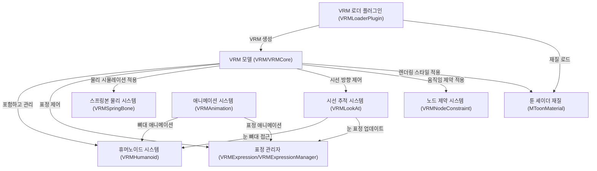

# Tutorial: three-vrm

three-vrm은 **VRM 3D 아바타**를 Three.js에서 사용할 수 있게 해주는 라이브러리입니다.
*인간형 3D 모델*의 뼈대 구조, 표정, 물리 효과, 애니메이션 등 아바타의 모든 기능을
**통합적으로 관리**하고 제어할 수 있게 해줍니다. 특히 일본 애니메이션 스타일의
*가상 캐릭터*를 웹에서 표현하는 데 최적화되어 있습니다.

**Source Repository:** [None](None)

## Chapters

1. [VRM 로더 플러그인 (VRMLoaderPlugin)
   ](01_vrm_로더_플러그인__vrmloaderplugin__.md)
2. [VRM 모델 (VRM/VRMCore)
   ](02_vrm_모델__vrm_vrmcore__.md)
3. [휴머노이드 시스템 (VRMHumanoid)
   ](03_휴머노이드_시스템__vrmhumanoid__.md)
4. [툰 셰이더 재질 (MToonMaterial)
   ](04_툰_셰이더_재질__mtoonmaterial__.md)
5. [표정 관리자 (VRMExpression/VRMExpressionManager)
   ](05_표정_관리자__vrmexpression_vrmexpressionmanager__.md)
6. [시선 추적 시스템 (VRMLookAt)
   ](06_시선_추적_시스템__vrmlookat__.md)
7. [스프링본 물리 시스템 (VRMSpringBone)
   ](07_스프링본_물리_시스템__vrmspringbone__.md)
8. [애니메이션 시스템 (VRMAnimation)
   ](08_애니메이션_시스템__vrmanimation__.md)
9. [노드 제약 시스템 (VRMNodeConstraint)
   ](09_노드_제약_시스템__vrmnodeconstraint__.md)

---

Generated by [AI Codebase Knowledge Builder](https://github.com/The-Pocket/Tutorial-Codebase-Knowledge)
